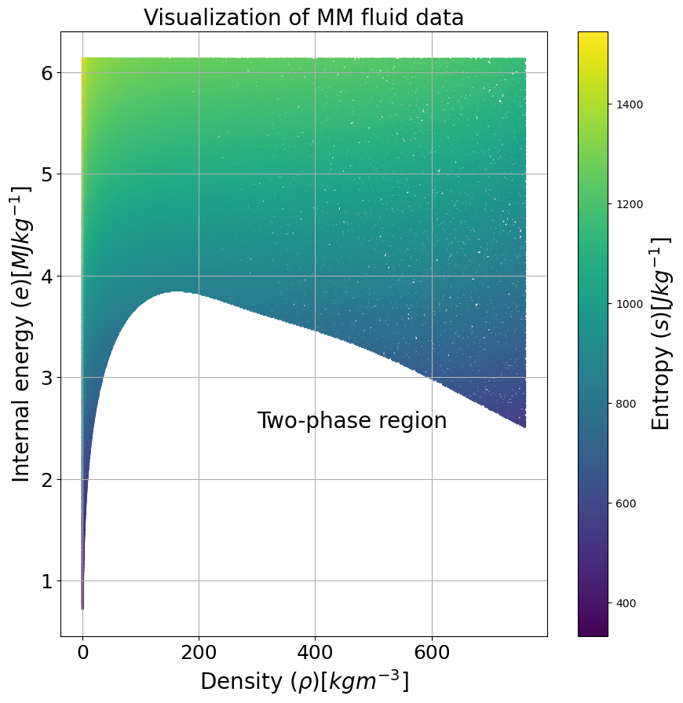
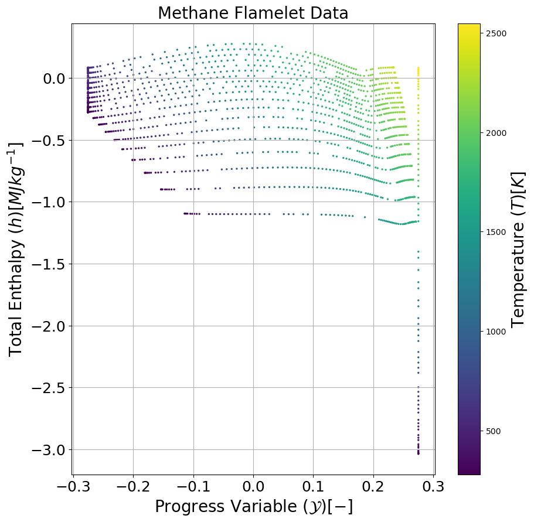

# SU2 Google Summer of Code Assignment 2:
# Extending Look-Up Table features for Thermodynamics and Chemistry

Welcome to the Google Summer of Code project! In order to get you started with writing a proposal, here is some information on the context.

Novel power and propulsion applications such as waste heat recovery systems and combustion chambers for zero-emission fuels such as hydrogen are designed using computational fluid dynamics (CFD) simulations. Such devices operate with fluids that behave very differently than normal air and can therefore not be modeled accurately by something like the ideal gas law. 

For example, waste heat recovery systems that operate through the organic rankine cycle (ORC) use fluids with complex molecular structures. This gives the fluid properties that are beneficial for exchanging and storing thermal energy, but are very difficult to model! 

In such a context, the thermo-chemical state of the fluid may be determined through a data-driven approach. Here, a look-up table (LUT) is used to determine the thermo-chemical state of the fluid based on a set of transported quantities calculated by the CFD solver. For example, the CFD solver computes the distribution of density and internal energy throughout the fluid domain. Then, the thermodynamic state is computed by interpolating a look-up table based on the local values for density and internal energy. 

A computational domain in CFD may be very large, consisting of millions of nodes for industrial applications. The LUT has to be interpolated for every node in the domain in order to calculate the thermodynamic state. In order to speed up the computation, the respective table has to be efficient in terms of query time and have a low memory footprint. 

SU2 currently uses a trapezoidal map-like approach for interpolating the thermodynamic state of the fluid during non-ideal CFD (NICFD) simulations and combustion simulations. This method was developed specifically for two-dimensional look-up problems. Although the current method is quite fast in terms of interpolation, it does not scale well with memory, is difficult to set up, and is quite restricted in terms of application. This limits the capability of SU2 to simulate large-scale problems involving complex fluid behavior. Here is where you can make a difference.

## Initial Ideas:
The main objective of this project is to develop a flexible library of LUT methods that can be used by SU2 during CFD simulations. By offering a range of look-up methods, it allows users to more easily set up simulations for fluids with complex behavior. Some ideas are listed below:

1. *Structured look-up table methods:* Structured look-up tables store data within a regular, N-dimensional grid. Such a table format is generally fast to interpolate and quick to set up. However, it does require the input data to be defined on a regular grid. If this is not the case, some pre-processing of the scattered data may be required.
2. *Unstructured methods:* Unstructured look-up methods such as the KD-tree and trapezoidal map allow for the interpolation of scattered data. This makes them flexible in terms of application. SU2 currently uses a simplified version of the trapezoidal map for thermo-chemical data interpolation. You can study this code as a reference. 
3. *Using the python wrapper:* In case you are more interested in working on the SU2 code itself, you can directly link the interpolation methods available in python to SU2 via the python wrapper. If you choose to work on this part, the focus will be less on implementing table algorithms, but more on linking various parts of the SU2 code and python wrapper. 

You can choose which method(s) to implement during this project.

## Model problems:
I have provided data for two applications on which you can test your algorithms. For each application, data sets for table construction and validation are provided. The objective is to implement algorithms which can accurately and efficiently interpolate the validation data (Validation) based on the table construction data (LUT). The data are provided in zip file format. Unzip the files to access the .csv-based data files, where the variable names are in the header of each file. 

Both the data for NI-CFD and combustion application are examples of real data which can be used for computations in SU2. If you want to test the performance scaling of your algorithm with data size, larger data sets can be provided. Both data sets contain highly scattered data. You will be using your LUT algorithms to interpolate the output variables based on the query variables as accurately as possible. 

The following two data sets are just example applications. If you want to test your algorithms in different applications or test its capability on smaller data sets, it is recommended you generate your own unit tests.

### NI-CFD
The first application is the computation of the fluid thermodynamic state for complex fluids. Based on density, internal energy, and the partial derivatives of entropy w.r.t. density and energy, it is possible to generate a consistent equation of state. This method is described more in detail in [this paper](Literature/M.Pinietal.-Data-DrivenRegressionofThermodynamicModelsinEntropicForm.pdf). 

Two data sets are provided, one for air, one for the refrigerant siloxane MM and one for air. The data sets contain the following variables:

Query variables:
- Density
- Energy 

Output variables:
- entropy
- entropy derivative w.r.t. density (dsdrho_e)
- entropy derivative w.r.t. internal energy (dsde_rho)
- curvature of entropy w.r.t. density (d2sdrho2)
- curvature of entropy w.r.t. density and energy (d2sdedrho)
- curvature of entropy w.r.t. energy (d2sde2) 

The data for siloxane MM is visualized below. Here, the entropy and its partial derivatives w.r.t. density and internal energy are defined for the single-phase region. The goal is to interpolate the entropy and its partial derivatives for a given combination of density and internal energy.

### Combustion
The second application is the computation of the thermo-chemical state for combustion simulation purposes. The type of simulation is the so-called flamelet-generated manifold (FGM), where the thermo-chemical state is determined based on a set of transported scalars. For the current application, two fuels are considered: hydrogen and methane. 

For the methane data set, consider the following variables:

Query variables:
- Progress Variable (ProgressVariable)
- Total enthalpy (EnthalpyTot)

Output variables:
- Temperature (Temperature)
- Specific heat (Cp)
- Mean molar weight (MolarWeightMix)
- Reaction rate (ProdRateTot_PV)

The distribution of progress variable and total enthalpy is shown in the figure below. Given a combination of progress variable and total enthalpy, are you able to accurately interpolate the thermo-chemical quantities using your table library?

For the hydrogen data set, consider the following variables:

Query variables:
- Progress Variable (ProgressVariable)
- Total enthalpy (EnthalpyTot)
- Mixture fraction (MixtureFraction)

Output variables:
- Temperature (Temperature)
- Specific heat (Cp)
- Mean molar weight (MolarWeightMix)
- Reaction rate (ProdRateTot_PV)
- Diffusivity (D)

This data set is three-dimensional and is made up scattered data. This makes it quite the challenge to interpolate accurately, so try this example once you have completed the previous exercises.
